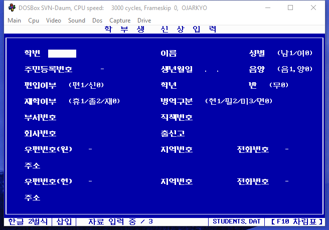
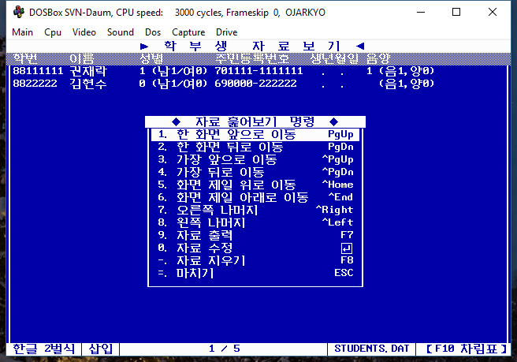

# Ojakyo
An application using HANTLE Database, a database system. Dos version. Built in 1993.

## Environment
* Tested in DOSBox 0.74-3* 
* Compile with Turbo C 2.01 (`C:\TC2`) 
* Hangul: Halla Pro Library 2.40 (`C:\HLIB2`) 
  - Missing header files: `HINPUT.H`, `HKEYDEF.H` --> `C:\HLIB2\INCLUDE2`
  - I had to create them and added.
  
## Project files
  - Turbo C 2.01: `OJAKYO.PRJ `

## Compilers
* [Turbo C 2.01](https://drive.google.com/drive/folders/15jHp-THOiT0wDgwv7lfmTKjfJ_-m9nXl?usp=share_link)

## Halla Pro Libraries
Put the folder into C:\HLIB2 and C:\HLIB3 for Halla Pro 2.40 and 3.0 respectively.
* [Halla Pro 2.40](https://drive.google.com/drive/folders/1RSi1LYoDtEzr0scNMaP08mtITR92M5rY?usp=share_link)

## Screenshot

